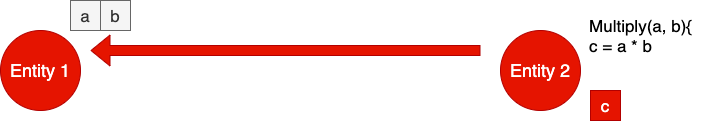

#Multithreading and Synchronization

What is thread ? Thread is a basic unit of execution flow. A process at least has one thread which is called main thread.
A thread runs in the context of a process. In fine _thread.c_, it is shown how to generate a child thread. Below code is to
compile an run it:

```
gcc -g -c thread.c -o thread.o
gcc -g thread.o -o thread.exe -lpthread
```

The main thread is paused in main function because if the main thread gets terminated, the child thread is also gets terminated.
Therefore, we put the main function or main thread to get halted before getting terminated so that the child thread gets executed.
Another important this to mention is below code where the child thread is getting generated:
```
pthread_create(&thread1, NULL, call_fn, (void*)args)
```
The last input variable should be either static or heap memory. In other words, it should be static variable or malloced ones.
There are three ways for the threads to get terminated:
1. The function which the thread runs returns a value
2. The thread executes ```pthread_exit(0)```
3. Another thread kills the running thread.

Multiple threads of the processes share same Virtual Address Space of a process. In other words, resources allocated by one 
thread is visible to the rest of the others. These resources are Heap Memory, Sockets, File Descriptors, global variables etc.
What threads do not share is the stack memory. In essence, every thread has its own stack memory.

When it comes to scheduling, OS do not schedule processes, but it schedules threads. However, this rule is violated in certain
error conditions:
1. If a thread generates segmentation fault, the entire process is terminated (including all threads)
2. A signal from hardware or kernel space is delivered to the correspnding process, but not the thread.

When a thread is created, it can be in one of the two modes:
1. Joinable thread: A thread is joinable when that thread joins the parent thread when it finishes its working. Note that, 
```pthread_join()``` should be added in the main thread so that the main thread gets blocked in this point til the child thread
finishes its working. After the child thread finishes its working, it sends a join signal to the parent thread so that the parent
thread gets released. By default, all created threads are joinable.
2. Detached thread: it is the opposite of joinable thread.

One thing to note here is that a child joinable thread upon termination joins all the threads which are blocked on pthread_join on 
former's thread handle.

-Create a thread Tas joinable when:
1. T is supposed to return some results to other threads like Map-Reduce 
2. When some threads are interested in being notified of other thread's termination

-Create thread T as detached when:
1. No return result from T is expected
2. Nobody bothers about its death
3. T runs in infinite loop
   1. waiting for user input
   2. waiting for network packet

**Transfer of Computation**: This concept is among threads that belongs to one virutal address space of a process. Suppose 
there are two entities in a process which represents threads. Entity one has two values and entity two has the formula to compute
the with the values which are in entity one. Instead of sending values from entity one to entity two, entity two sends the formula
to entity one.



Transfer of computation is nothing more than function call through function pointer. this is the pattern of communication 
which is based on Transfer Of Communication (TOC). The thread which generates the data is called **publisher** and the thread
which owns the data processing function is called **Subscriber**. The activity of TOC is called **Callback Registration**. The
activity of invoking the function through functin pointers by publisher is called **Notification**. 

**Notification Chains** is an architectural concept used to notify multiple subscribers interested in a particular event. A party
which generates an event is called **Publisher** and parties which are interested in being notified of the event are called
**Subscriber**. So, in essence, there is one publisher and multiple subscribers. 

**Thread Cancellation** refers to cancelling a thread while it is working. Any thread can cancel the operation of other threads by
calling ```thread_cancel()``` API. Threads can be canceled in two ways: Asynchronous or Deferred. In Asynchronous mode, a thread
which wants to cancel the operation of the other thread, sends a cancel request to the victim thread. At this point of time, the
OS will queue this request and after a while the OS cancels the victim thread. This is why it is called Asynchronous. However,
asynchronous cancellation of a thread may cause three below problems:
1. Resource leaking: there may be some variable on heap memory that are not get freed after cancelling the operation of the victim 
thread.
2. Cause invariant or data structure corruption
3. Deadlocks